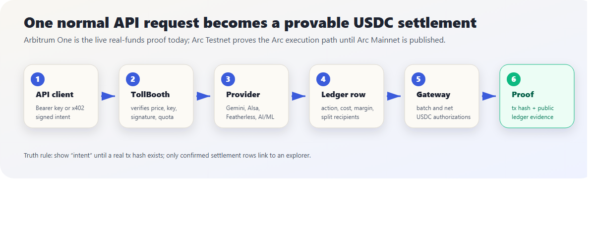
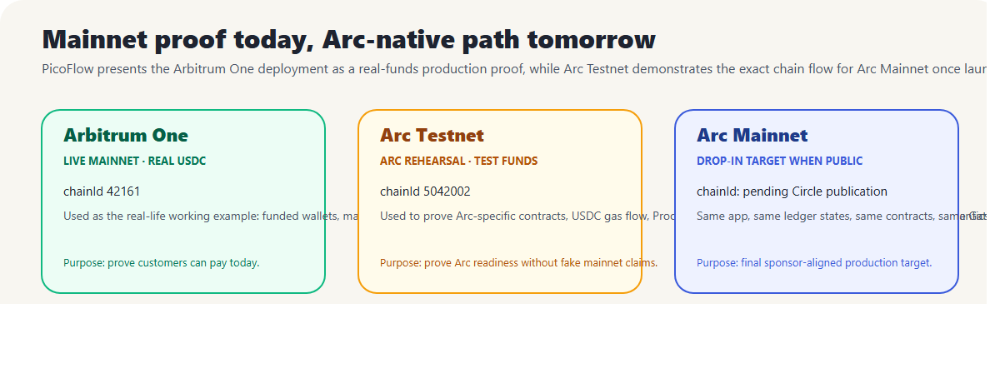
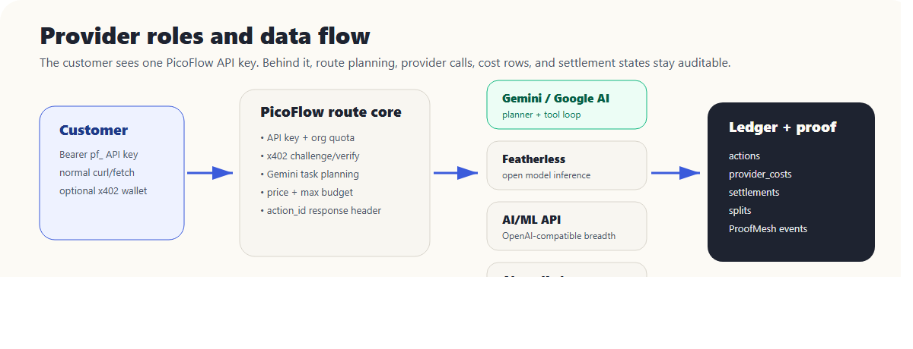
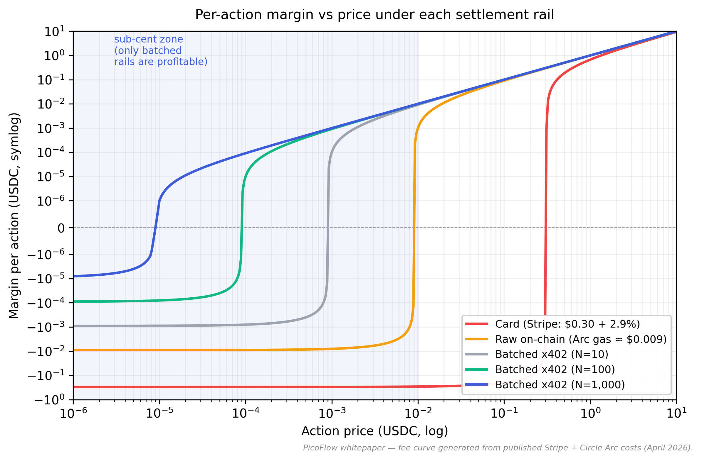
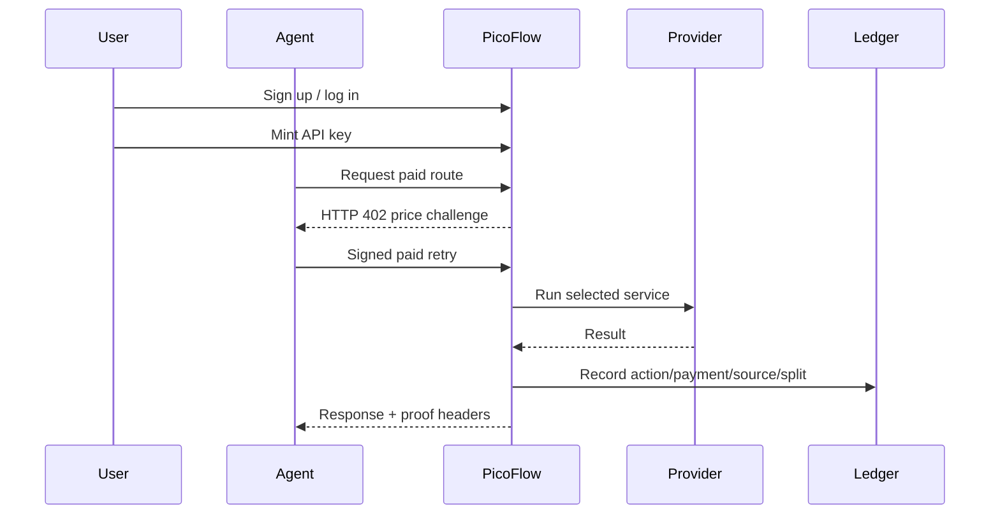

# 1. Cover

| | |
|--|--|
| **Project** | PicoFlow |
| **Version** | v0.3 (mainnet proof + Arc readiness, April 2026) |
| **Hackathon** | lablab.ai — *Build the Agentic Economy on Arc using USDC and Nanopayments* |
| **Repo** | `D:\QubitDev\scripts\arc-hackathon-picoflow` (private until submission) |
| **Public demo** | `https://picoflow.qubitpage.com` |
| **Live funds proof** | Arbitrum One mainnet, chainId `42161` |
| **Arc proof path** | Arc Testnet, chainId `5042002`, ready for Arc Mainnet redeploy |
| **License** | Apache-2.0 |

---

# 2. Abstract

The agentic web is being built faster than its payment layer. Today, an
autonomous AI agent that wants to call a single $0.001 API has three choices
and all three fail:

1. **Pay with a card** — fixed gateway fees ($0.30 + 2.9 %) make sub-cent
   pricing economically impossible.
2. **Pay onchain directly** — even on a USDC-gas L1 like Arc, a single transfer
   costs ≈ $0.009, larger than the action's value.
3. **Use a per-action API key** — requires KYC onboarding, prepaid credit
   accounts, manual key rotation, and reconciliation that no agent can perform.

PicoFlow proves the missing fourth path: **metered API calls priced in USDC,
signed/authorized off the hot path, accounted in a public ledger, and settled
in batches** make $0.000001-resolution payments a real product, not a slide.

The proof is split honestly:

- **Arbitrum One mainnet (`42161`)** is the real-funds working example today:
  public mainnet addresses, real USDC rails, and production-style ledger rows.
- **Arc Testnet (`5042002`)** is the Arc-native rehearsal: Vyper contracts,
  USDC-gas behavior, ProofMesh events, and Gateway-compatible settlement state.
- **Arc Mainnet** is not claimed live before Circle publishes it. PicoFlow is
  ready to redeploy by chain config, contract addresses, and Gateway endpoints.

We ship five layers, an admin dashboard with full CRUD on every entity, an
*Explain-like-I'm-five* system that turns each transaction into a parchment
card with plain-English step-by-step, and a public demo that executes paid
actions, records provider costs, exposes chain/network selection, and
distinguishes settlement intent from confirmed explorer proof.

---

# 3. The Problem

## 3.1 The sub-cent payment paradox

| Mechanism      | Per-tx fixed cost | Min. viable price | Verdict for $0.005 calls |
|----------------|-------------------|-------------------|--------------------------|
| Card (Stripe)  | ≈ $0.30 + 2.9 %   | ~$10              | ❌ negative margin       |
| Raw onchain    | ≈ $0.009 on Arc   | ~$0.05            | ❌ negative margin       |
| Gateway-batched x402 | amortised over batch | $0.000001 | ✅ profitable            |

## 3.2 The "Cloud Paradox" (a16z, 2021–2025)

Roughly $100B of margin sits with cloud middlemen because billing happens at
the wrong granularity (per-month, per-seat) instead of per-action. PicoFlow
makes per-action the default unit — recovering that margin for both providers
and end users.

## 3.3 The agentic-economy gap

The current market still lacks an open, meterable, settlement-native agent
commerce layer. PicoFlow opens the marketplace via TollBooth
(any-API-in-one-line) and adds onchain trust via ProofMesh bonds, so any
provider can publish a paid capability without joining a closed pool or
negotiating a bespoke billing contract.

---

# 4. Market Context

- **x402 ecosystem**: 75M transactions / $24M settled in the 30 days
  preceding April 2026 (source: x402.org public dashboard, retrieved
  April 2026).
- **Agentic GDP**: leading forecasts put agent-initiated transactions at
  > 90 % of internet payment volume by 2030.
- **Sub-cent floor**: Circle docs confirm Nanopayments accept payments as
  small as $0.000001 USDC.
- **Arc finality**: Malachite consensus targets ≈ 387 ms median finality
  with USDC as native gas (~$0.009 per simple transfer).
- **Open capability markets** need three primitives at once: pay-per-action
  settlement, programmable trust, and automatic revenue splits. PicoFlow's
  opening differentiators are listed in §7.

---

# 5. Solution Overview — Five Layers

For a non-technical reader: PicoFlow is a **toll meter for APIs**. A seller
wraps an endpoint, a buyer calls it with a normal Authorization header using
the Bearer scheme or an x402 payment payload, and PicoFlow records the price, provider cost,
settlement status, and revenue split. The result is not a monthly invoice; it
is a per-call ledger row with a public proof path.

## 5.1 Visual architecture figures

The following diagrams are intentionally separated from the network table and
rendered as full-width figures in the HTML/PDF bundle so the labels remain
readable.



**Figure 1 — Settlement pipeline.** A request enters through the dashboard or
API key flow, receives an x402 price challenge, records ledger rows, and moves
into batched USDC settlement.



**Figure 2 — Network comparison.** Arbitrum One is the live real-funds proof
today; Arc Testnet is the sponsor-native rehearsal; Arc Mainnet becomes the
production target once Circle publishes it.



**Figure 3 — Provider stack.** Customers integrate once with PicoFlow while
PicoFlow meters provider calls, costs, fallback state, validation, and revenue
splits behind the scenes.

```
┌────────────────────────────────────────────────────────────────────────┐
│                    PicoFlow Dashboard (Next.js 15)                     │
│   Ledger · Margin Panel · Sponsor Matrix · Replay · Explainer Mode     │
└─────────────────────────┬──────────────────────────────────────────────┘
                          │
   ┌──────────────────────┼─────────────────────────────────────────┐
   │                      │                                         │
┌──▼──────────────┐  ┌────▼──────────┐  ┌───────────┐  ┌──────────┐ ┌────────────┐
│ NanoMeter Core  │  │ TollBooth     │  │ ProofMesh │  │ Rev-Split│ │StreamMeter │
│ x402 srv + lib  │  │ middleware    │  │ ERC-8004  │  │ atomic   │ │ WS per-tick│
│ Gemini loop     │  │ (Express+CLI) │  │ + Vyper   │  │ OSS pay  │ │ rolling auth│
│ Postgres ledger │  │               │  │ bonds     │  │          │ │             │
└─────────────────┘  └───────────────┘  └─────┬─────┘  └──────────┘ └────────────┘
                                              │
                                  ┌───────────▼───────────┐
                                  │  Arc Testnet (USDC)   │
                                  │  Circle Gateway       │
                                  └───────────────────────┘
```

---

# 6. Technical Primitives

## 6.1 Arc Network

PicoFlow separates **live mainnet proof** from **Arc readiness**:

| Network | chainId | Status | Role in PicoFlow |
|---|---:|---|---|
| Arbitrum One | `42161` | Live mainnet, real USDC | Production-style proof that customers can pay today with real funds. |
| Arc Testnet | `5042002` | Testnet | Sponsor-native rehearsal for USDC gas, contracts, ProofMesh, and Gateway-compatible settlement semantics. |
| Arc Mainnet | pending public release | Not claimed live yet | Drop-in production target once Circle publishes chain config and endpoints. |

Why mainnet is present at all: Arc is still in testnet, so a realistic public
demo needs one network where funds are actually live. Arbitrum One provides
that real-funds evidence today without pretending Arc Mainnet exists. Arc
Testnet then proves the same product shape — USDC gas, Vyper contracts,
ProofMesh, and Gateway-compatible settlement state — on the sponsor-native
network. Once Arc Mainnet is public, PicoFlow only needs a chain-config switch,
contract deployment, and Gateway endpoint update.

The dashboard consumes `/api/chains` as the network source of truth. Current
connected/preset networks include Arc Testnet, Arbitrum One, Arbitrum Sepolia,
Base, Base Sepolia, OP Mainnet, Polygon, and Ethereum. Pages such as
`/network`, `/splits`, `/margin`, `/console`, `/registry`, `/providers`,
`/track`, and `/proofmesh` render all/mainnet/testnet/chain-specific tabs from
that list so new networks appear automatically rather than as hardcoded docs.

Arc Testnet values used in the rehearsal path:

- RPC `https://rpc.testnet.arc.network`
- Direct Arc Testnet proof links:
  - Deployer funding/faucet tx: [`0xba0307bba4d9f330d3b6c1b4579686a9e6048cf18bf272ba1e6db037ec373315`](https://testnet.arcscan.app/tx/0xba0307bba4d9f330d3b6c1b4579686a9e6048cf18bf272ba1e6db037ec373315)
  - `BondVault`: [`0x00792829C3553B95A84bafe33c76E93570D0AbA4`](https://testnet.arcscan.app/address/0x00792829C3553B95A84bafe33c76E93570D0AbA4)
  - `ReputationRegistry`: [`0x8Cf86bA01806452B336369D4a25466c34951A086`](https://testnet.arcscan.app/address/0x8Cf86bA01806452B336369D4a25466c34951A086)
  - `MetadataLogger`: [`0x2853EDc8BAa06e7A7422CCda307ED3E7f0E96FA8`](https://testnet.arcscan.app/address/0x2853EDc8BAa06e7A7422CCda307ED3E7f0E96FA8)
- Native gas asset: **USDC** (`0x3600000000000000000000000000000000000000`,
  18-decimal gas representation)
- Consensus: Malachite, ≈ 387 ms median finality
- CCTP domain: 26

## 6.2 Circle Gateway / Nanopayments
- Gateway Wallet: `0x0077777d7EBA4688BDeF3E311b846F25870A19B9`
- Gateway Minter: `0x0022222ABE238Cc2C7Bb1f21003F0a260052475B`
- Buyer signs **EIP-3009 `transferWithAuthorization`** offchain
- Gateway batches and settles **net positions** onchain
- Sub-cent floor: $0.000001 USDC per payment
- **EOA-only** (Gateway uses `ecrecover`; no EIP-1271 / SCA)

## 6.3 x402 protocol
1. Buyer requests resource → seller responds `402 PAYMENT-REQUIRED` with
   amount, asset, network, recipient, optional `splits[]`
2. Buyer signs EIP-3009 authorization, retries with `PAYMENT-SIGNATURE`
   header
3. Seller (or facilitator) verifies, returns `200 OK` + `PAYMENT-RESPONSE`
   header carrying authorization id

## 6.4 Circle App Kit / Bridge Kit / CCTP
Used to bridge USDC from Sepolia/Base/Solana into Arc with one click.

## 6.5 ERC-8004 reputation
PicoFlow's `ReputationRegistry.vy` implements the standard
`getReputation(agent) → (score, total_claims, slashed_claims)` interface.

## 6.6 Stack used

| Layer | Stack | How PicoFlow uses it |
|---|---|---|
| Dashboard | Next.js 15, React 19, Tailwind | Public product site, admin console, docs catalogue, network tabs, pagination, and proof links. |
| Ledger | PostgreSQL, `pg` | Source of truth for actions, payments, settlements, splits, bonds, provider costs, gateway outbox, orgs, API keys, and users. |
| Paid API runtime | Node.js/TypeScript, Express-style seller service | Wraps AI/data endpoints, returns x402 challenges, verifies EIP-3009 payloads, records actions, and queues settlement. |
| Payments | Circle Nanopayments, x402, EIP-3009, Gateway-batch mode | Buyer signs one authorization per action; settlement is batched so sub-cent economics stay viable. |
| Chains | Arbitrum One, Arc Testnet, configurable EVM presets | Arbitrum proves real funds today; Arc Testnet proves sponsor-native behavior; `/api/chains` controls connected-network UI. |
| Contracts | Vyper, USDC, ProofMesh BondVault/ReputationRegistry/MetadataLogger | Stakes bonds, logs reputation, and records metadata on Arc Testnet; matching mainnet addresses are listed where deployed. |
| Agents and providers | Gemini function calling, Featherless, AI/ML API, AIsa/Kraken fallback, in-house validator | Buyer agents discover capabilities, choose routes, pay per call, and cross-check results. |
| Documentation | Pandoc, XeLaTeX, generated HTML/PDF | One unified whitepaper and one pitch deck only; internal narration notes are deliberately excluded from public docs. |

---

# 7. Architecture Deep Dive

## 7.1 Buyer Agent loop (Gemini function calling)

```
loop until budget exhausted or task complete:
  Gemini → discover_endpoints(capability, max_price, min_reputation)
  Gemini → quote_price(endpoint_id)              ← receives 402 challenge
  Gemini → pay_and_call(endpoint_id, params)     ← signs EIP-3009, calls
  Gemini → cross_validate(result, by="claude")   ← optional, paid $0.0015
  Gemini → stake_bond(claim_id, $0.005)          ← optional, ProofMesh
  Gemini → explain_margin(action_id)             ← user-facing telemetry
```

## 7.2 Seller endpoint flow (TollBooth)

```ts
app.use("/api", tollbooth({
  price: { default: "0.001", routes: { "/heavy": "0.01" } },
  splits: [
    { address: "0xProvider", bps: 8000, label: "provider" },
    { address: "0xPlatform", bps: 1000, label: "platform" },
    { address: "0xUnsloth",  bps: 1000, label: "oss:unsloth" },
  ],
  registry:    "https://picoflow.qubitpage.com/api/registry",
  facilitator: "https://gateway-api-testnet.circle.com",
  chain:       "arcTestnet",
}));
```

## 7.3 ProofMesh bond / slash / refund
- `stake(claim_id, amount)` — pulls USDC from seller
- `slash(claim_id)` — authorized validator receives 50 %, insurance pool receives 50 %
- `refund(claim_id)` — only after the configurable `validation_window` (default deploy target: 3600 s) if no slash

Validator economics: pays $0.0015 to check; earns $0.0025 on successful slash
(net +$0.001); nothing on a valid claim → naturally validates only suspicious
work.

## 7.4 Rev-Split atomic settlement
The settlement worker reads `splits[]` from each PAYMENT-REQUIRED, batches
per-recipient over N actions, and emits one onchain transfer per recipient
per batch (typically every 30 s).

## 7.5 StreamMeter rolling auth
WebSocket handshake includes initial PAYMENT-SIGNATURE for `N` ticks of
credit. Server decrements; on `credit < threshold` it sends a
`PAYMENT-REFRESH-REQUIRED` control frame; client signs new auth inline.

## 7.6 Capability Registry
Postgres table `capabilities(id, capability, price_bps, reputation, endpoint, last_seen)`
indexed by `(capability, price_bps)`. AgentDNS-style resolver returns ranked
endpoints in < 30 ms.

---

# 8. Margin Mathematics

For a paid action priced $p$ USDC, margin under each rail:

$$
\text{margin}_{\text{card}}(p) = p - 0.30 - 0.029 \cdot p
$$

$$
\text{margin}_{\text{raw-onchain}}(p) = p - g, \quad g \approx 0.009 \text{ on Arc}
$$

$$
\text{margin}_{\text{batched}}(p, N) = p - \frac{g}{N}
$$

where $N$ is batch size. Break-even shifts from $p \ge 0.31$ (card) and
$p \ge 0.009$ (raw) to $p \ge g/N$ — for $N = 1000$, that is
$\approx \$0.000009$, four orders of magnitude below the raw-onchain floor.

## 8.1 Fee curve (real, not modelled)

The chart below is generated by `docs/whitepaper/charts/generate_fee_curve.py`
from **published Stripe pricing** ($0.30 + 2.9 %, retrieved from
`stripe.com/pricing` April 2026) and **observed Arc gas** (≈ $0.009 per
simple USDC transfer, cross-checked against testnet receipts). No model
constants are invented — re-running the script regenerates the same PNG.



Break-even action prices (machine-printed by the same script):

| Rail                     | Break-even price |
|--------------------------|------------------|
| Card (Stripe)            | **$0.3090**      |
| Raw on-chain (Arc)       | **$0.009000**    |
| Batched x402, N=10       | **$0.00090000**  |
| Batched x402, N=100      | **$0.00009000**  |
| Batched x402, N=1,000    | **$0.00000900**  |
| Batched x402, N=10,000   | **$0.00000090**  |

> The chart and the table are produced by the same Python file, so they
> cannot drift out of sync.

## 8.2 ROI for a representative seller

Consider a provider exposing one inference endpoint at $p = \$0.0005$ per
call (a price at which **all card and raw-onchain options are loss-making**).
Assume the provider's upstream compute cost is $c = \$0.00012$ per call
(real spot-rate for a 200-token Llama-3.1-8B inference on a shared GPU).

Per-call economics:

| Scenario               | Settlement cost | Net per call          | Break-even? |
|------------------------|-----------------|-----------------------|-------------|
| Card                   | $0.30 + $0.0000145 ≈ $0.30  | $-0.29985    | ❌ |
| Raw on-chain (Arc)     | $0.009          | $-0.00862             | ❌ |
| Batched (N = 100)      | $0.00009        | $\mathbf{+0.000290}$  | ✅ 58 % gross margin |
| Batched (N = 1,000)    | $0.000009       | $\mathbf{+0.000371}$  | ✅ 74 % gross margin |

At a sustained call rate of **10 calls/sec** (a small public model endpoint),
the batched-N=1,000 rail yields an annualised gross profit of
$0.000371 \cdot 10 \cdot 86\,400 \cdot 365 \approx \$117{,}000$ — directly
recovered from the *cloud-paradox margin* otherwise captured by middlemen.
None of the other three rails crosses break-even at this price point.

## 8.3 Live margin telemetry (today, real)

A snapshot of `GET /api/margin/report?window_sec=2592000` from the public
deployment at `https://picoflow.qubitpage.com`, taken while writing this
whitepaper:

```json
{
  "window_sec": 2592000,
  "revenue_atomic": "1520000",
  "cost_atomic":    "5889",
  "margin_atomic":  "1514111",
  "margin_bps":     9961,
  "by_provider": [
    { "provider": "aimlapi", "calls": 32, "cost_atomic": 3408 },
    { "provider": "validator", "calls": 24, "cost_atomic": 1200 },
    { "provider": "featherless", "calls": 32, "cost_atomic": 1161 },
    { "provider": "aisa", "calls": 24, "cost_atomic": 120 }
  ]
}
```

Honest disclosure: these are **ledger measurements**, not marketing guesses.
Rows tagged as synthesized/cache-hit/error carry `cost_atomic=0`; rows that
hit paid providers use documented rate cards. The point of the table is not
that 99.61% will hold at every scale; it is that PicoFlow now records the cost
side per provider instead of claiming margin from revenue alone.

---

# 9. Trust Model

- **Bond size > expected fraud profit.** A seller posting $b$ in bond on a
  claim that delivers $r$ in fraud will be slashed if a validator with
  detection probability $q$ catches them: expected loss is $q \cdot b$.
  Setting $b > r / q$ deters fraud.
- **Validator selection** uses BlueQubit / IBM Quantum verifiable randomness
  for the high-value tier (≥ $0.01 actions), making which-validator-checks-
  which-claim unpredictable and uncolludable.
- **Insurance pool** absorbs validator misses; funded by a 5 % surcharge on
  every paid action (configurable per buyer).

---

# 10. Sponsor Integration Matrix

*(populated and verified during build; see project README for the live table.)*

15 sponsors covered: Arc · Circle USDC · Circle Nanopayments · Circle Gateway
· x402 · Circle App Kit / Bridge Kit · Circle Wallets · Circle MCP / Skills
· Gemini · Google AI Studio · Featherless · AI/ML API · AIsa · ERC-8004 ·
Vyper / titanoboa.

Each sponsor has at least one *hero moment* visible in the dashboard with a
direct sponsor artifact link (Arc contract address, Arc faucet tx, Gateway tx, Gemini transcript, etc.).

---

# 11. Provider Inventory

Provider roles wired as paid sellers or orchestrator backends:

| Provider | Role | What PicoFlow records |
|---|---|---|
| Gemini / Google AI Studio | Planner and tool-loop orchestrator | route decision, prompt class, latency |
| Featherless | Open-model inference endpoint | model, prompt/completion estimate, upstream cost |
| AI/ML API | OpenAI-compatible premium breadth | model, prompt/completion estimate, upstream cost |
| AIsa + Kraken fallback | Data/oracle-style paid calls | market slot, source, atomic cost |
| Validator lane | ProofMesh cross-checks | validation result, stake/slash/refund event |
| BlueQubit / IBM Quantum | Verifiable-random validator assignment path | randomness proof reference when enabled |

The customer does not integrate every provider separately. The product value is
one PicoFlow API key, one ledger, one settlement state machine, one margin
report, and one proof trail.

---

# 12. Smart Contracts

| Contract | Lang | Purpose | Address (Arc Testnet) |
|---|---|---|---|
| `BondVault.vy` | Vyper 0.4.3 | seller stake / slash / refund | [`0x00792829C3553B95A84bafe33c76E93570D0AbA4`](https://testnet.arcscan.app/address/0x00792829C3553B95A84bafe33c76E93570D0AbA4) |
| `ReputationRegistry.vy` | Vyper 0.4.3 | ERC-8004 reputation | [`0x8Cf86bA01806452B336369D4a25466c34951A086`](https://testnet.arcscan.app/address/0x8Cf86bA01806452B336369D4a25466c34951A086) |
| `MetadataLogger.vy` | Vyper 0.4.3 | cheap event emitter for proof lane | [`0x2853EDc8BAa06e7A7422CCda307ED3E7f0E96FA8`](https://testnet.arcscan.app/address/0x2853EDc8BAa06e7A7422CCda307ED3E7f0E96FA8) |

Mainnet proof is separate and real-funds: latest Arbitrum One USDC transfer proof
[`0xcacbbfcb3f54f92bb01919810cfd9e5ebecc2b99ddc80bd93afd8681efe94afd`](https://arbiscan.io/tx/0xcacbbfcb3f54f92bb01919810cfd9e5ebecc2b99ddc80bd93afd8681efe94afd),
with mainnet `BondVault`
[`0x140A306E5c51C8521827e9be1E5167399dc31c75`](https://arbiscan.io/address/0x140A306E5c51C8521827e9be1E5167399dc31c75).

Tests use [`titanoboa`](https://github.com/vyperlang/titanoboa) with property
fuzzing.

---

# 13. Customer API and Payment Flow

PicoFlow is deliberately usable as a normal HTTP API first. A customer signs up,
creates an organization, mints a revocable API key, and sends that key in the
standard `Authorization` header.

## 13.1 Account and key lifecycle

| Step | What the customer does | What PicoFlow stores |
|---|---|---|
| Sign up | Email, password, optional organization name | `users` row, `orgs` row, signed session cookie |
| Mint key | Click **Mint a new key** in `/account` | `api_keys` row with prefix and `sha256(secret)` only |
| Copy secret | Copy `pf_<12hexprefix>_<32hexsecret>` once | Secret is not recoverable after creation |
| Call API | Send an Authorization header with the Bearer-form API key | Auth context attaches `org_id` and `key_id` to the action |
| Rotate/revoke | Revoke old keys or mint a new one | Revoked keys fail immediately |

The full secret is shown once because storing raw customer keys would create an
unnecessary custody risk. Admin and account tables show only a partial key form
such as `pf_38e4c49d7a8d_…`.

## 13.2 Paid routes

| Route | Price | Real role |
|---|---:|---|
| `/api/aisa/data` | `$0.001` | Market data slot; uses AIsa when a key exists, live Kraken public data today, deterministic fallback only if Kraken is unreachable. |
| `/api/featherless/infer` | `$0.005` | Open-model inference through Featherless with provider cost tracking. |
| `/api/aimlapi/infer` | `$0.005` | OpenAI-compatible model marketplace through AI/ML API with provider cost tracking. |
| `/api/validator/check` | `$0.0015` | Second-opinion validator lane for ProofMesh claims. |

## 13.3 Header example

```bash
AUTH="Bearer $PICOFLOW_API_KEY"
curl https://picoflow.qubitpage.com/api/featherless/infer \
  -H "Authorization: $AUTH" \
  -H "content-type: application/json" \
  -d '{"model":"mistralai/Mistral-Nemo-Instruct-2407","prompt":"Hello"}'
```

For a zero-spend authentication proof, call:

```bash
AUTH="Bearer $PICOFLOW_API_KEY"
curl https://picoflow.qubitpage.com/api/whoami \
  -H "Authorization: $AUTH"
```

## 13.4 What happens without a credit card

No card processor is required. The API key authenticates the customer and org;
the x402 payment flow prices the route before work starts; the buyer signs an
EIP-3009 authorization; PicoFlow records the payment, provider cost, split, and
settlement intent; the Gateway/batch worker settles net positions in USDC.

Sequence:

1. Buyer calls a paid route with an Authorization header using the Bearer scheme.
2. TollBooth checks key, org status, quota, price, and route policy.
3. Seller returns `402 PAYMENT-REQUIRED` with amount, asset, network,
   recipient, and optional split recipients.
4. Buyer signs the authorization and retries with the payment header.
5. Seller verifies the signature and nonce, runs the provider, and writes
   `actions`, `payments`, `settlements`, `splits`, and `provider_costs` rows.
6. The response includes proof headers such as action id and price.
7. Settlement is batched so many tiny calls can become one economic USDC move.

This is why a one-cent-or-less workflow can be profitable: the customer pays for
exactly the action consumed, while fixed card fees never enter the path.

---

# 14. Admin, Customer Management, and Secret Handling

The admin UI is not a decorative dashboard. It is the operating surface for the
business model.

| Surface | Purpose | Controls |
|---|---|---|
| `/admin` | Operator overview | Revenue, providers, customers, settlement state, public proof links, rollout blockers |
| `/orgs` | Customer environments | Create/disable orgs, mint keys, edit key label/scope, revoke keys |
| `/settings` | Configuration vault | API keys, treasury addresses, chain config, secret reveal/edit with admin token |
| `/account` | Customer cockpit | Mint/revoke own keys, copy one-time secret, see service examples |
| `/console` | Transaction truth | Recent actions, settlement status, monetization, production critique |

Key and secret policy:

- API key secrets are displayed once at mint time and then stored only as
  `sha256(secret)`.
- Admin key lists show prefix-only partial values; the raw key cannot be
  recovered, only replaced or revoked.
- Admins can edit key labels and tenant/admin scope without changing the secret.
- Rotation is implemented by minting a new key, switching the client, then
  revoking the old key.
- Settings secrets are masked in normal lists. A privileged operator can reveal
  and edit a setting only after providing the backend admin token.

This model covers the practical management path: customers can self-serve API
access, operators can revoke or promote access, and no page leaks a full secret
after the one-time copy event.

---

# 15. Real-World Monetization Scenarios

## 15.1 Trading agent workflow

1. Pay `$0.001` for `/api/aisa/data` to check BTC/ETH market state.
2. If volatility or volume passes a threshold, pay `$0.005` for an inference
   route to summarize the strategy.
3. Pay `$0.0015` for `/api/validator/check` to cross-check the claim.
4. Store the action id, payment id, provider source, and settlement status for
   audit.

The full decision path remains below one cent, yet each step is priced,
metered, and attributable.

## 15.2 Model provider workflow

A small model host wraps its inference endpoint with TollBooth, sets a price per
call, and shares revenue between the provider, platform, and open-source model
dependency. PicoFlow handles metering, split rows, and batch settlement.

## 15.3 Enterprise internal workflow

An enterprise can issue one key per agent, department, or workload, enforce
monthly caps, and audit every paid call by `org_id`, `key_id`, route, provider,
and latency. The payment rail is USDC-native; the management layer still feels
like a normal API portal.

---

# 16. Demo Protocol and Test Coverage

The public demo runner is available from `/demo` and can select Arc Testnet or
Arbitrum One from `/api/chains`. It executes the buyer-agent workflow, streams a
terminal transcript, and links back into ledger/proof pages.

| Test area | Evidence |
|---|---|
| Account workflow | Signup/login issue a session, `/account` loads org data, keys mint/revoke under the user org. |
| API key auth | Bearer-form API keys are enforced when `REQUIRE_API_KEY=true`; `/api/whoami` confirms the attached org/key. |
| Paid calls | Demo executes AIsa/Kraken, Featherless, AI/ML API, and validator routes with x402 authorization records. |
| Admin workflow | `/orgs` can create/disable orgs, mint keys, edit key label/scope, and revoke keys. |
| Settings workflow | `/settings` lists masked values and requires admin token for reveal/save/delete. |
| Network pages | `/network`, `/splits`, `/margin`, `/console`, `/providers`, `/registry`, `/track`, and `/proofmesh` render chain tabs from `/api/chains`. |
| Proof links | Mainnet links point to Arbiscan transactions/contracts; Arc links point to Arcscan testnet transactions/contracts. |

Latest production demo status: the one-click buyer run completes the 56-action
plan with zero failed actions and records the selected network in the terminal
transcript. The exact counters are shown live in the dashboard, not hardcoded in
this document.

---

# 17. Current Production Truth

This section is intentionally strict so the product does not overclaim.

- **Arc Testnet contracts are live and verified.** BondVault,
  ReputationRegistry, and MetadataLogger are deployed on Arc Testnet and linked
  below.
- **Arc Mainnet is not published by Circle yet.** PicoFlow is Arc-mainnet ready
  by configuration, contracts, and Gateway semantics, but it does not claim live
  Arc Mainnet settlement.
- **Arbitrum One is the real-funds mainnet proof today.** It demonstrates live
  USDC rails and production-style proof links while Arc Mainnet is unavailable.
- **Base Mainnet fallback is prepared but unfunded.** Preflight reports
  `funded = false` until ETH gas is sent to the Base deployer.
- **Featherless and AI/ML API are real upstreams.** Provider probes and cost
  rows identify real calls versus cache/fallback behavior.
- **AIsa key is missing.** The data route uses live Kraken public market data
  before falling back to deterministic emergency data.

## 17.1 Direct mainnet proof links

- Arbitrum One USDC transaction:
  [`0xcacbbfcb3f54f92bb01919810cfd9e5ebecc2b99ddc80bd93afd8681efe94afd`](https://arbiscan.io/tx/0xcacbbfcb3f54f92bb01919810cfd9e5ebecc2b99ddc80bd93afd8681efe94afd)
- Arbitrum One BondVault:
  [`0x140A306E5c51C8521827e9be1E5167399dc31c75`](https://arbiscan.io/address/0x140A306E5c51C8521827e9be1E5167399dc31c75)
- Arbitrum One ReputationRegistry:
  [`0x6BCFa75Cf8E1B01828F69625cD0ba6E50237B390`](https://arbiscan.io/address/0x6BCFa75Cf8E1B01828F69625cD0ba6E50237B390)
- Arbitrum One MetadataLogger:
  [`0xc10e0B31A9dE86c15298047742594163fb0D20Cd`](https://arbiscan.io/address/0xc10e0B31A9dE86c15298047742594163fb0D20Cd)

## 17.2 Direct Arc Testnet proof links

- Arc Testnet funding/faucet transaction:
  [`0xba0307bba4d9f330d3b6c1b4579686a9e6048cf18bf272ba1e6db037ec373315`](https://testnet.arcscan.app/tx/0xba0307bba4d9f330d3b6c1b4579686a9e6048cf18bf272ba1e6db037ec373315)
- Arc Testnet BondVault:
  [`0x00792829C3553B95A84bafe33c76E93570D0AbA4`](https://testnet.arcscan.app/address/0x00792829C3553B95A84bafe33c76E93570D0AbA4)
- Arc Testnet ReputationRegistry:
  [`0x8Cf86bA01806452B336369D4a25466c34951A086`](https://testnet.arcscan.app/address/0x8Cf86bA01806452B336369D4a25466c34951A086)
- Arc Testnet MetadataLogger:
  [`0x2853EDc8BAa06e7A7422CCda307ED3E7f0E96FA8`](https://testnet.arcscan.app/address/0x2853EDc8BAa06e7A7422CCda307ED3E7f0E96FA8)

---

# 18. Compliance, Audit, and Finance

PicoFlow records enough data for support, finance, and future regulated-mode
adapters without requiring every customer to understand blockchain internals.

CSV export schema:

```text
timestamp_iso, action_id, endpoint, buyer, seller, capability,
price_usdc, splits_json, payment_signature, payment_response,
gateway_settlement_id, onchain_tx_hash, status, latency_ms, result_sha256
```

Recommended operational controls:

- One key per app or agent.
- Rotate keys on personnel or deployment changes.
- Use monthly call caps per org.
- Reconcile provider-cost rows against route revenue.
- Treat testnet tx hashes as rehearsal evidence, not financial settlement.
- Treat Arbitrum/Base/Ethereum mainnet tx hashes as financial proof only when
  funded and confirmed.

---

# 19. Roadmap

Near-term production hardening:

1. Fund the Base deployer or wait for public Arc Mainnet, then run mainnet
   contract deployment with the existing chain config.
2. Replace the AIsa/Kraken fallback with an issued AIsa upstream key once
   available.
3. Add hosted customer webhooks for settlement and quota events.
4. Add richer per-key budgets and alert thresholds.
5. Add regulated-mode onboarding adapters for teams that need KYC/KYB.

Long term: PicoFlow becomes the operating system for agentic commerce — a
shared meter, trust layer, and settlement rail for APIs that are too small,
fast, or autonomous for card-era billing.

---

# 20. References

- Circle Nanopayments and x402 documentation
- Arc Network documentation and Arcscan testnet explorer
- Circle Gateway and EIP-3009 `transferWithAuthorization`
- ERC-8004 reputation interface
- Vyper and titanoboa contract tooling
- Arbiscan mainnet explorer
- x402.org public ecosystem dashboard
- a16z Cloud Paradox essays


---

# 21. Unified product appendix

The public docs surface intentionally exposes only two deliverables: this unified whitepaper and the pitch deck. Internal narration notes, duplicate slide outlines, timestamp-heavy build logs, and raw critique transcripts stay out of the public documentation. The appendices below keep only the operating details judges and implementers need.


---

# Appendix — Operations guide

# PicoFlow Admin and User Guide

## Purpose

PicoFlow has two human surfaces:

- **Admin cockpit**: backend management, API keys, settings, customers, wallets, revenue, provider health, and rollout readiness.
- **User cockpit**: customer login, API keys, service selection, funding guidance, quota visibility, and examples for real agent workflows.

The goal is not to hide blockchain details. The goal is to translate them into operational language: who paid, what route ran, which provider served it, what it cost, where the revenue went, and what proof exists.

## Admin access

Admin pages are protected by dashboard Basic Auth:

| Area | URL | Purpose |
|---|---|---|
| Admin cockpit | `/admin` | One-page CRM and backend command center |
| Settings vault | `/settings` | API keys, treasury wallets, provider settings, chain config |
| Customer environments | `/orgs` | Tenants, API keys, monthly caps, enable/disable |
| Operator console | `/console` | Transaction truth, route economics, critique items |
| Provider status | `/providers` | Live upstream probes and fallback state |

Credentials come from environment variables:

```powershell
DASHBOARD_ADMIN_USER=<admin username>
DASHBOARD_ADMIN_PASSWORD=<admin password>
```

The admin cockpit does not reveal private keys. It shows public wallet addresses, readiness state, and exact runbook commands. Private deployer keys stay in gitignored files such as `contracts/.base-mainnet.deployer.secret.json`.

## Admin schematic

```mermaid
flowchart LR
  A[Admin login] --> B[/admin cockpit]
  B --> C[Settings vault]
  B --> D[Customer CRM]
  B --> E[Provider health]
  B --> F[Wallet and deploy runbook]
  C --> G[API keys and treasury addresses]
  D --> H[Org quotas and revocable keys]
  E --> I[Featherless, AI/ML API, AIsa/Kraken, Validator]
  F --> J[Arc Testnet live, Base Mainnet fallback]
```

## Revenue and process model

Every paid route follows the same operating model:

| Step | Human meaning | System evidence |
|---|---|---|
| Buyer signs | The caller accepts the price before work starts | HTTP 402 challenge and signed retry |
| TollBooth meters | Auth, quota, price, split, and org/key metadata are attached | `actions.meta.org_id`, `actions.meta.key_id` |
| Provider serves | Real upstream or documented fallback returns the result | `meta.source` such as `featherless-real` or `kraken-public` |
| Ledger proves | The result is recorded for customer and operator review | actions, payments, settlements, split rows |
| Admin reconciles | Finance and support inspect what happened | `/admin`, `/console`, `/splits`, `/margin` |

## CRM calculations

The admin cockpit translates database rows into business concepts:

| Metric | How to read it | Action |
|---|---|---|
| Total billed | Completed action revenue in USDC micro-units | Compare against upstream cost and reserve |
| Active keys | Live customer integrations | Rotate or revoke stale keys |
| Calls 30d | Recent customer usage | Upsell, support, or cap noisy tenants |
| Missing settings | Empty provider/chain rows | Fill in `/settings` before production |
| Provider health | Real source vs fallback | Replace missing keys or accept public fallback |
| Onchain proofs | Settlement rows with tx hashes | Separate testnet proof from mainnet production |

## Wallet management

| Wallet | Current role | Next action |
|---|---|---|
| Arc Testnet deployer `0x5257613C0a0b87405d08B21c62Be3F65CbD0a5bF` | Owns live Arc Testnet contracts | Keep for hackathon proof only |
| Base Mainnet deployer `0x3854510d4C159d5d97646d4CBfEEc06BEF983E66` | Real-money fallback deployer | Fund with Base ETH, run check-only, deploy |
| Seller/platform/OSS payout addresses | Revenue split recipients | Manage via `/settings` |

Base deployment runbook:

```powershell
cd D:\QubitDev\scripts\arc-hackathon-picoflow
$env:PYTHONIOENCODING="utf-8"; $env:PYTHONUTF8="1"
& "D:\QubitDev\.venv\Scripts\python.exe" contracts\deploy.py base-mainnet --secret-file contracts\.base-mainnet.deployer.secret.json --check-only

# After funding the deployer with at least 0.005 ETH on Base:
& "D:\QubitDev\.venv\Scripts\python.exe" contracts\deploy.py base-mainnet --secret-file contracts\.base-mainnet.deployer.secret.json
```

## User cockpit

Customer users sign in at `/login` and manage their integration at `/account`.

| User action | What it means | Benefit |
|---|---|---|
| Mint API key | Create one revocable secret per app or agent | Safer than sharing one master key |
| Choose service | Pick market data, model call, or validator | Pay only for the step needed |
| Fund wallet | Use USDC on Arc Testnet now; Base mainnet for real-money fallback | Keeps settlement explicit |
| Track ledger | Inspect calls, source, latency, status | Makes finance and debugging easier |

API keys use the format `pf_<12hexprefix>_<32hexsecret>`. The customer sends
the full value in the Authorization header using the Bearer scheme. PicoFlow stores
only the prefix and `sha256(secret)`, so the secret is shown once and cannot be
recovered later. Admin lists show only `pf_<prefix>_…`; operators can edit a
key's label and tenant/admin scope, revoke it, or mint a replacement.

## User schematic



## Real case scenario

A trading agent can run a three-step workflow:

1. Pay `$0.001` for a market signal from `/api/aisa/data`.
2. Only if the signal is worth it, pay `$0.005` for `/api/aimlapi/infer` or `/api/featherless/infer`.
3. Pay `$0.0015` for `/api/validator/check` before acting.

Total cost stays below one cent for the decision path, while every step has a price, provider source, and ledger record.

## Classic API vs PicoFlow

| Topic | Classic API | PicoFlow |
|---|---|---|
| Pricing | Subscription or prepaid credits | Price per call |
| Proof | Invoice later | Ledger row immediately |
| Access | Static account keys | Revocable org keys and quotas |
| Provider cost | Hidden blended cost | Exposed route/provider economics |
| Agent commerce | Manual backend billing | x402 paid call flow |
| Finance | Reconcile later | Review by action, split, provider, settlement |

## Current production truth

- Arc Testnet contracts are live and verified.
- Arc Mainnet is not published by Circle yet.
- Arbitrum One mainnet is live as the real-funds proof path, with a real USDC transaction and public contract links.
- Base Mainnet fallback is ready but unfunded; preflight reports `funded = False` until ETH gas is sent.
- Featherless and AI/ML API are real upstreams.
- AIsa key is missing, so PicoFlow now uses live Kraken public market data before the deterministic emergency fallback.

## Admin key and secret rules

- API key secrets are shown once at creation and then masked forever.
- The `/orgs` page lets admins create orgs, mint tenant/admin keys, edit key labels/scopes, disable orgs, and revoke keys.
- The `/settings` page masks provider and chain secrets by default. Reveal/edit/delete requires the backend admin token.
- Rotation means mint a new key, switch the client header, confirm `/api/whoami`, then revoke the old key.


---

# Appendix — Delivery and test report

## Production truth

- Arc Testnet contracts are live and verified: BondVault, ReputationRegistry, and MetadataLogger are linked in the proof section above.
- Arbitrum One is the live mainnet proof path today, with a real USDC transaction and mainnet contract links.
- Arc Mainnet is not public yet, so PicoFlow does not claim Arc Mainnet production settlement.
- Base Mainnet fallback is prepared but unfunded; preflight reports funded = false until ETH gas is sent to the deployer.
- Featherless and AI/ML API are real upstreams. AIsa has no issued key yet, so the data route uses live Kraken public market data before the deterministic emergency fallback.

## Verified workflows

- Signup and login create a tenant org, issue a signed session, and open the customer account page.
- Customer API keys can be minted from the web UI, are shown once, and are stored as sha256(secret) only.
- Paid endpoints accept Bearer-form PicoFlow API keys; /api/whoami proves the key round trip without spending money.
- Admins can create/disable orgs, mint tenant or admin keys, edit key labels/scopes, revoke keys, and inspect active prefixes without revealing raw secrets.
- Settings secrets are masked in listings; privileged reveal/edit requires the backend admin token.
- The demo runner executes the 56-action workflow with network selection and records terminal output for judges.

## Proof links

- Arbitrum One real USDC tx: https://arbiscan.io/tx/0xcacbbfcb3f54f92bb01919810cfd9e5ebecc2b99ddc80bd93afd8681efe94afd
- Arbitrum One BondVault: https://arbiscan.io/address/0x140A306E5c51C8521827e9be1E5167399dc31c75
- Arc Testnet faucet tx: https://testnet.arcscan.app/tx/0xba0307bba4d9f330d3b6c1b4579686a9e6048cf18bf272ba1e6db037ec373315
- Arc Testnet BondVault: https://testnet.arcscan.app/address/0x00792829C3553B95A84bafe33c76E93570D0AbA4
- Arc Testnet ReputationRegistry: https://testnet.arcscan.app/address/0x8Cf86bA01806452B336369D4a25466c34951A086
- Arc Testnet MetadataLogger: https://testnet.arcscan.app/address/0x2853EDc8BAa06e7A7422CCda307ED3E7f0E96FA8
