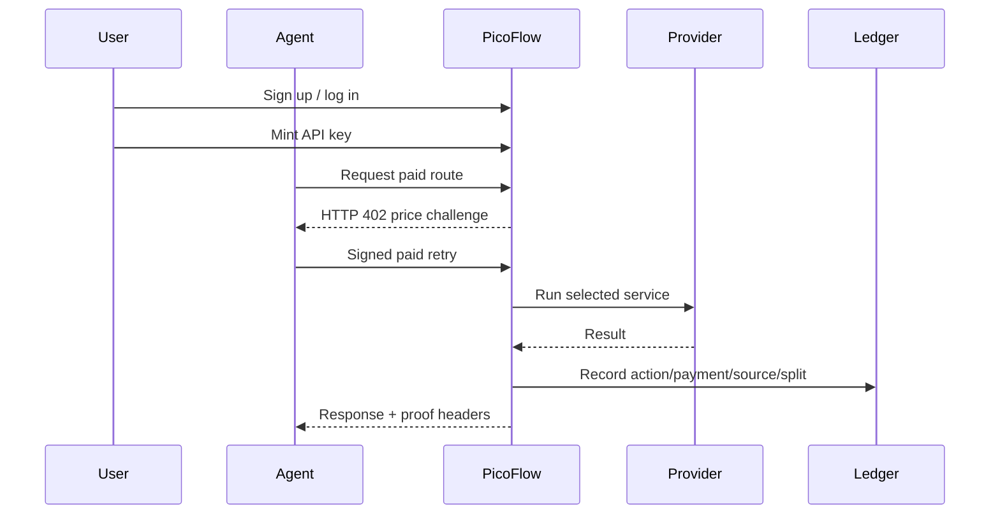

# PicoFlow Admin and User Guide

## Purpose

PicoFlow has two human surfaces:

- **Admin cockpit**: backend management, API keys, settings, customers, wallets, revenue, provider health, and rollout readiness.
- **User cockpit**: customer login, API keys, service selection, funding guidance, quota visibility, and examples for real agent workflows.

The goal is not to hide blockchain details. The goal is to translate them into operational language: who paid, what route ran, which provider served it, what it cost, where the revenue went, and what proof exists.

## Admin access

Admin pages are protected by dashboard Basic Auth:

| Area | URL | Purpose |
|---|---|---|
| Admin cockpit | `/admin` | One-page CRM and backend command center |
| Settings vault | `/settings` | API keys, treasury wallets, provider settings, chain config |
| Customer environments | `/orgs` | Tenants, API keys, monthly caps, enable/disable |
| Operator console | `/console` | Transaction truth, route economics, critique items |
| Provider status | `/providers` | Live upstream probes and fallback state |

Credentials come from environment variables:

```powershell
DASHBOARD_ADMIN_USER=<admin username>
DASHBOARD_ADMIN_PASSWORD=<admin password>
```

The admin cockpit does not reveal private keys. It shows public wallet addresses, readiness state, and exact runbook commands. Private deployer keys stay in gitignored files such as `contracts/.base-mainnet.deployer.secret.json`.

## Admin schematic

```mermaid
flowchart LR
  A[Admin login] --> B[/admin cockpit]
  B --> C[Settings vault]
  B --> D[Customer CRM]
  B --> E[Provider health]
  B --> F[Wallet and deploy runbook]
  C --> G[API keys and treasury addresses]
  D --> H[Org quotas and revocable keys]
  E --> I[Featherless, AI/ML API, AIsa/Kraken, Validator]
  F --> J[Arc Testnet live, Base Mainnet fallback]
```

## Revenue and process model

Every paid route follows the same operating model:

| Step | Human meaning | System evidence |
|---|---|---|
| Buyer signs | The caller accepts the price before work starts | HTTP 402 challenge and signed retry |
| TollBooth meters | Auth, quota, price, split, and org/key metadata are attached | `actions.meta.org_id`, `actions.meta.key_id` |
| Provider serves | Real upstream or documented fallback returns the result | `meta.source` such as `featherless-real` or `kraken-public` |
| Ledger proves | The result is recorded for customer and operator review | actions, payments, settlements, split rows |
| Admin reconciles | Finance and support inspect what happened | `/admin`, `/console`, `/splits`, `/margin` |

## CRM calculations

The admin cockpit translates database rows into business concepts:

| Metric | How to read it | Action |
|---|---|---|
| Total billed | Completed action revenue in USDC micro-units | Compare against upstream cost and reserve |
| Active keys | Live customer integrations | Rotate or revoke stale keys |
| Calls 30d | Recent customer usage | Upsell, support, or cap noisy tenants |
| Missing settings | Empty provider/chain rows | Fill in `/settings` before production |
| Provider health | Real source vs fallback | Replace missing keys or accept public fallback |
| Onchain proofs | Settlement rows with tx hashes | Separate testnet proof from mainnet production |

## Wallet management

| Wallet | Current role | Next action |
|---|---|---|
| Arc Testnet deployer `0x5257613C0a0b87405d08B21c62Be3F65CbD0a5bF` | Owns live Arc Testnet contracts | Keep for hackathon proof only |
| Base Mainnet deployer `0x3854510d4C159d5d97646d4CBfEEc06BEF983E66` | Real-money fallback deployer | Fund with Base ETH, run check-only, deploy |
| Seller/platform/OSS payout addresses | Revenue split recipients | Manage via `/settings` |

Base deployment runbook:

```powershell
cd D:\QubitDev\scripts\arc-hackathon-picoflow
$env:PYTHONIOENCODING="utf-8"; $env:PYTHONUTF8="1"
& "D:\QubitDev\.venv\Scripts\python.exe" contracts\deploy.py base-mainnet --secret-file contracts\.base-mainnet.deployer.secret.json --check-only

# After funding the deployer with at least 0.005 ETH on Base:
& "D:\QubitDev\.venv\Scripts\python.exe" contracts\deploy.py base-mainnet --secret-file contracts\.base-mainnet.deployer.secret.json
```

## User cockpit

Customer users sign in at `/login` and manage their integration at `/account`.

| User action | What it means | Benefit |
|---|---|---|
| Mint API key | Create one revocable secret per app or agent | Safer than sharing one master key |
| Choose service | Pick market data, model call, or validator | Pay only for the step needed |
| Fund wallet | Use USDC on Arc Testnet now; Base mainnet for real-money fallback | Keeps settlement explicit |
| Track ledger | Inspect calls, source, latency, status | Makes finance and debugging easier |

API keys use the format `pf_<12hexprefix>_<32hexsecret>`. The customer sends
the full value in the Authorization header using the Bearer scheme. PicoFlow stores
only the prefix and `sha256(secret)`, so the secret is shown once and cannot be
recovered later. Admin lists show only `pf_<prefix>_…`; operators can edit a
key's label and tenant/admin scope, revoke it, or mint a replacement.

## User schematic



## Real case scenario

A trading agent can run a three-step workflow:

1. Pay `$0.001` for a market signal from `/api/aisa/data`.
2. Only if the signal is worth it, pay `$0.005` for `/api/aimlapi/infer` or `/api/featherless/infer`.
3. Pay `$0.0015` for `/api/validator/check` before acting.

Total cost stays below one cent for the decision path, while every step has a price, provider source, and ledger record.

## Classic API vs PicoFlow

| Topic | Classic API | PicoFlow |
|---|---|---|
| Pricing | Subscription or prepaid credits | Price per call |
| Proof | Invoice later | Ledger row immediately |
| Access | Static account keys | Revocable org keys and quotas |
| Provider cost | Hidden blended cost | Exposed route/provider economics |
| Agent commerce | Manual backend billing | x402 paid call flow |
| Finance | Reconcile later | Review by action, split, provider, settlement |

## Current production truth

- Arc Testnet contracts are live and verified.
- Arc Mainnet is not published by Circle yet.
- Arbitrum One mainnet is live as the real-funds proof path, with a real USDC transaction and public contract links.
- Base Mainnet fallback is ready but unfunded; preflight reports `funded = False` until ETH gas is sent.
- Featherless and AI/ML API are real upstreams.
- AIsa key is missing, so PicoFlow now uses live Kraken public market data before the deterministic emergency fallback.

## Admin key and secret rules

- API key secrets are shown once at creation and then masked forever.
- The `/orgs` page lets admins create orgs, mint tenant/admin keys, edit key labels/scopes, disable orgs, and revoke keys.
- The `/settings` page masks provider and chain secrets by default. Reveal/edit/delete requires the backend admin token.
- Rotation means mint a new key, switch the client header, confirm `/api/whoami`, then revoke the old key.
